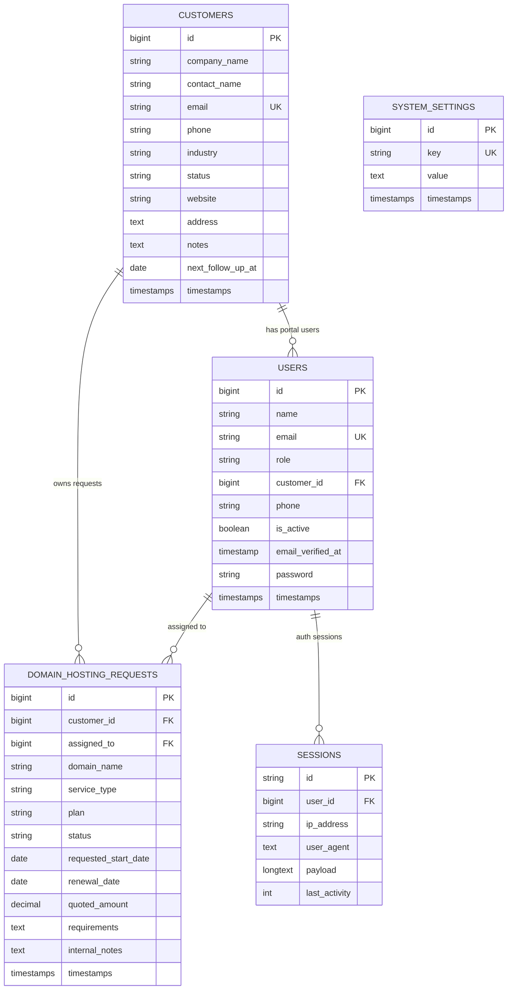

# NextGen CRM ERD and Wireframe

Generated from the current Laravel models, migrations, and routes.

## ERD



## Staff/Admin Wireframe

```text
+--------------------------------------------------------------------------+
| Header: notifications | account menu                                     |
+----------------------+---------------------------------------------------+
| Brand logo/name      | Page title + breadcrumbs                          |
| User identity        |                                                   |
|                      | Dashboard metrics                                 |
| Navigation           | [Customers] [Domains] [Suspended] [Support] [Reg] |
| - Customers          |                                                   |
| - Renewals           | Customer listing / forms / support tables         |
| - Add Customer       |                                                   |
| - Support            | Support Request Detail                            |
|   - Support Requests | - Customer / assignee / dates / quote             |
|   - Registrations    | - Requirements                                    |
| - Bulk Email Tool    | - Internal notes                                  |
| - Admin Settings     |                                                   |
+----------------------+---------------------------------------------------+
```

## Admin Settings Wireframe

```text
+--------------------------------------------------------------------------+
| Admin User and Email Settings                               Save Settings |
+--------------------------------------------------------------------------+
| Admin User Listing                                                       |
| Name | Email | Send Emails                                               |
|                                                                          |
| Header Branding                                                          |
| System Name [____________________]                                       |
| Logo Image  [Choose File]                                                |
| Current logo preview                                                     |
|                                                                          |
| Email Settings                                                           |
| From Address | From Name | Mail Host | Mail Port                         |
+--------------------------------------------------------------------------+
```

## Customer Portal Wireframe

```text
+--------------------------------------------------------------------------+
| Customer Portal                                                          |
+--------------------------------------------------------------------------+
| Customer account summary                                                 |
| Own service requests                                                     |
| Submit new domain, hosting, email, ISP, CCTV, document, or dev request   |
+--------------------------------------------------------------------------+
```
