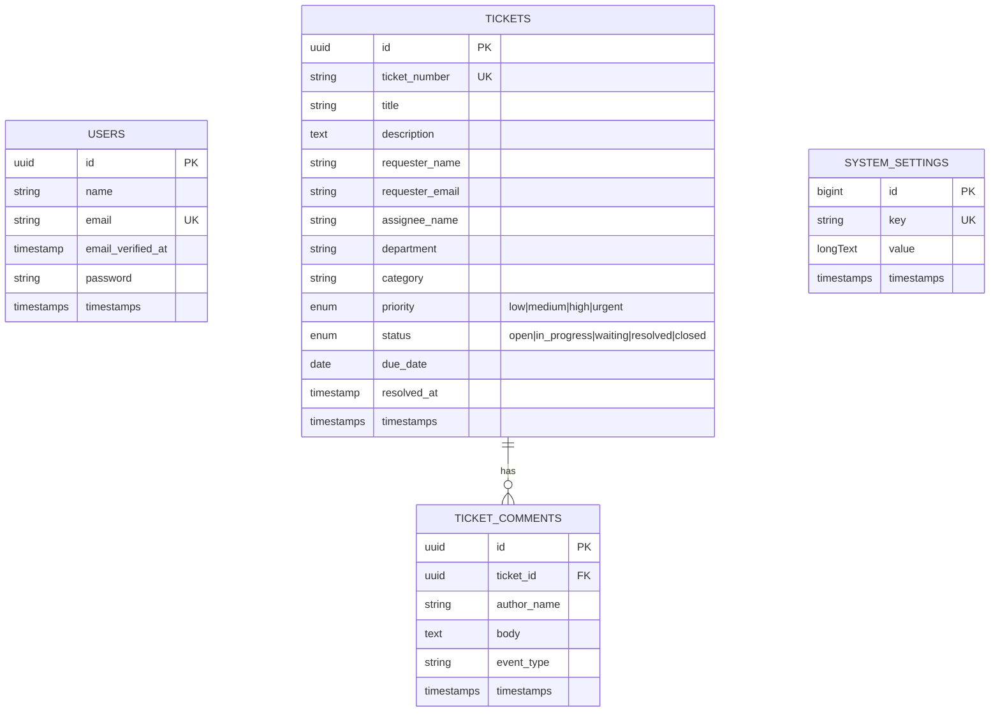

# Nextgens Ticketing System ERD

## Notes

- `tickets.category` represents Nextgen service lines: Domain Hosting, Email Support, ISP / VSAT, AI CCTV Security, Document Management, and Software Engineering.
- `tickets.department` is used as the client, branch, or department name.
- `ticket_comments.event_type` separates normal comments from system events such as ticket creation and status changes.
- `system_settings` stores editable company, support, and profile settings. The profile photo is stored as a data URL so clone-and-run XAMPP setups do not require a storage symlink.
- Current authentication is scaffolded through Laravel users, but the ticket workflow is not yet role-restricted.
